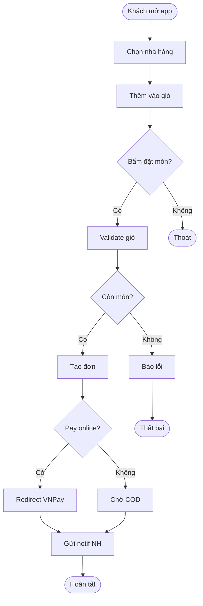

# BPMN & Process Flow

BPMN (Business Process Model and Notation) là **ngôn ngữ vẽ quy trình chuẩn quốc tế**, ai cũng đọc được không cần học sâu. Dùng cho mọi quy trình có nhiều bước, nhiều người, nhiều hệ thống.

## Khi nào cần vẽ BPMN?

✅ Quy trình > 5 bước
✅ Có nhiều role tham gia (KH, NV, hệ thống)
✅ Có branching/decision (rẽ nhánh)
✅ Có exception/loop
✅ Cần optimize quy trình (As-Is → To-Be)
✅ Onboard nhân viên mới
✅ Audit/compliance

❌ Quy trình quá đơn giản (1-3 bước thẳng) — viết text đủ rồi

## BPMN — Các ký hiệu cốt lõi

### 1. Event (Sự kiện) — Hình tròn

```
○         ◉         ●
Start    Intermediate  End
```

- **Start** (vòng mỏng): điểm bắt đầu
- **Intermediate** (vòng đôi): sự kiện giữa flow (timer, message)
- **End** (vòng dày): điểm kết thúc

### 2. Task/Activity (Hành động) — Hình chữ nhật bo tròn

```
┌─────────────────┐
│  Khách đặt món  │
└─────────────────┘
```

Loại task:
- **User Task** (👤): cần con người làm
- **Service Task** (⚙️): hệ thống tự động làm
- **Send/Receive Task** (✉️): gửi/nhận message
- **Script Task** (📜): script tự động
- **Manual Task** (✋): hoàn toàn thủ công, ngoài hệ thống

### 3. Gateway (Cổng quyết định) — Hình thoi

```
        ◇
       ╱ ╲
      ╱   ╲
```

Loại gateway:
- **Exclusive (XOR)** — Dấu ✕: chỉ chọn 1 nhánh
- **Parallel (AND)** — Dấu +: làm song song tất cả nhánh
- **Inclusive (OR)** — Dấu ○: có thể chọn 1+ nhánh
- **Event-based**: chờ event xảy ra mới quyết định

### 4. Flow (Mũi tên)

- **Sequence Flow** (─►): thứ tự bước trong cùng lane
- **Message Flow** (- - ▷): trao đổi message giữa các pool
- **Association** (- - -): liên kết với data/note

### 5. Pool & Lane (Swimlane)

```
┌─────────────────────────────────────────┐
│ Pool: Hệ thống đặt món                  │
├─────────────────────────────────────────┤
│Lane: Khách hàng                          │
│  ○─────► [Đặt món] ─────► ◇             │
├─────────────────────────────────────────┤
│Lane: Hệ thống                            │
│         [Tạo đơn] ─────► [Tính tiền]     │
├─────────────────────────────────────────┤
│Lane: Nhà hàng                            │
│                          [Xác nhận]      │
└─────────────────────────────────────────┘
```

- **Pool** = 1 tổ chức/hệ thống độc lập
- **Lane** = 1 role/bộ phận trong pool

### 6. Artifact (Dữ liệu/Ghi chú)

- **Data Object** (📄): tài liệu, dữ liệu input/output
- **Data Store** (🗄️): database, kho lưu trữ
- **Annotation** (💬): note giải thích

## Ví dụ BPMN đầy đủ: Quy trình đặt món

```
┌──────────────────────────────────────────────────────────────┐
│ POOL: App "Ăn Gì Hôm Nay"                                    │
├──────────────────────────────────────────────────────────────┤
│ LANE: Khách hàng                                              │
│                                                                │
│  ○ ──► [Mở app] ──► [Chọn nhà hàng] ──► [Thêm vào giỏ]       │
│                                              │                 │
│                                              ▼                 │
│                                       [Bấm "Đặt món"]          │
│                                              │                 │
├──────────────────────────────────────────────┼────────────────┤
│ LANE: Hệ thống                               │                 │
│                                              ▼                 │
│                                    ◇ Còn món? ─NO──►[Báo lỗi]│
│                                              │YES         │   │
│                                              ▼            ●  │
│                                    [Tạo đơn (PENDING)]        │
│                                              │                 │
│                                              ▼                 │
│                                    ◇ Online pay? ─NO──┐       │
│                                              │YES      │       │
│                                              ▼         │       │
│                                  [Redirect VNPay]      │       │
│                                              │         │       │
│                                  ◇ Pay OK? ─NO─►[Hủy đơn] ●   │
│                                              │YES      │       │
│                                              ▼         │       │
│                                  [Đánh dấu PAID] ◄─────┘       │
│                                              │                 │
│                                              ▼                 │
│                                  [Gửi notif NH]                │
│                                              │                 │
├──────────────────────────────────────────────┼────────────────┤
│ LANE: Nhà hàng                               │                 │
│                                              ▼                 │
│                                  [Nhận notif]                  │
│                                              │                 │
│                                              ▼                 │
│                                  ◇ Chấp nhận? ─NO──►[Huỷ + hoàn tiền] ●│
│                                              │YES                │
│                                              ▼                   │
│                                  [Chuẩn bị món]                  │
│                                              │                   │
│                                              ▼                   │
│                                  [Giao cho shipper]              │
│                                              │                   │
│                                              ▼                   │
│                                  ●                                │
└──────────────────────────────────────────────────────────────────┘
```

## As-Is vs To-Be Analysis

Quy trình BA thường làm:

### 1. Vẽ As-Is (hiện trạng)
- Phỏng vấn user → vẽ đúng cách họ đang làm
- Không phán xét, không đề xuất → chỉ ghi nhận
- Tìm: bottleneck, redundancy, manual work, paper trail

### 2. Gap Analysis
| Vấn đề (As-Is) | Tác động | Nguyên nhân gốc |
|---|---|---|
| Khách phải gọi điện đặt món | Mất khách cuối tuần (NV nghỉ) | Không có channel online |
| Nhà hàng note bằng giấy | Sai sót 5-10%, mất giấy | Không có app cho nhà hàng |
| Tính tiền thủ công | Chậm, sai | Không có POS tích hợp |

### 3. Vẽ To-Be (mong muốn)
- Áp dụng nguyên tắc: tự động hoá, loại bỏ bước thừa, parallel hoá
- Vẽ lại quy trình mới

### 4. Migration Plan
Phase nào làm gì để đi từ As-Is → To-Be?

## Nguyên tắc thiết kế quy trình tốt

### 1. Loại bỏ (Eliminate)
- Bước nào không add value?
- Approval nào không cần thiết?

### 2. Đơn giản hoá (Simplify)
- Bước phức tạp tách thành bước đơn giản hơn
- Form 20 trường → 5 trường + bước nâng cao optional

### 3. Tự động hoá (Automate)
- Bước nào con người làm máy có thể làm?
- Approval rule-based → auto

### 4. Parallel hoá (Parallelize)
- Bước nào đang serial có thể chạy song song?

### 5. Outsource (đẩy ra)
- Bước nào có thể giao cho khách tự làm (self-service)?

## Công cụ vẽ BPMN

| Công cụ | Ưu | Nhược | Cost |
|---|---|---|---|
| **draw.io** (diagrams.net) | Free, online, save Google Drive | UI hơi cũ | Free |
| **Lucidchart** | Đẹp, collaboration tốt | Paid sau 3 docs | Free tier |
| **Bizagi Modeler** | Chuẩn BPMN nhất | Desktop only Windows | Free |
| **Camunda Modeler** | Vẽ + chạy được (executable) | Cho dev | Free |
| **Miro / FigJam** | Workshop online | Không chuẩn BPMN 100% | Free tier |
| **Mermaid** | Code-as-diagram, version control | Limited BPMN | Free |

**Recommend**: **draw.io** cho 90% trường hợp. **Camunda** nếu muốn process tự động chạy.

## Mermaid BPMN-lite (cho dev)

Nếu muốn vẽ trong Markdown:



Lưu trong markdown file → GitHub render tự động.

## Anti-patterns

❌ **Spaghetti diagram** — quá nhiều crossing arrow → re-arrange layout
❌ **Mọi bước đều cùng size** → highlight bước quan trọng to/đậm hơn
❌ **Quên error path** — chỉ vẽ happy path → khi build mới phát hiện thiếu
❌ **Mix levels** — bước "Đặt món" cạnh bước "Click button submit" → khác nhau abstraction
❌ **Không có start/end rõ ràng** — diagram không tự đứng
❌ **Quá chi tiết** — vẽ down to từng API call → đó là sequence diagram, không phải BPMN
❌ **Không update** — quy trình thay đổi mà BPMN cũ → misleading

## Áp dụng cho solo developer

- Solo dev thường không cần BPMN formal
- Nhưng **vẽ flowchart đơn giản** cho mọi feature có > 5 bước hoặc có branching
- Dùng **Excalidraw** vẽ 5 phút, lưu screenshot trong commit message
- Đặc biệt hữu ích để track edge cases trước khi code

**Template gọn cho solo dev:**
1. Vẽ happy path 1 đường thẳng
2. Thêm decision diamond cho mỗi câu hỏi "nếu... thì..."
3. List exception case dưới cùng
4. Done — bắt đầu code
