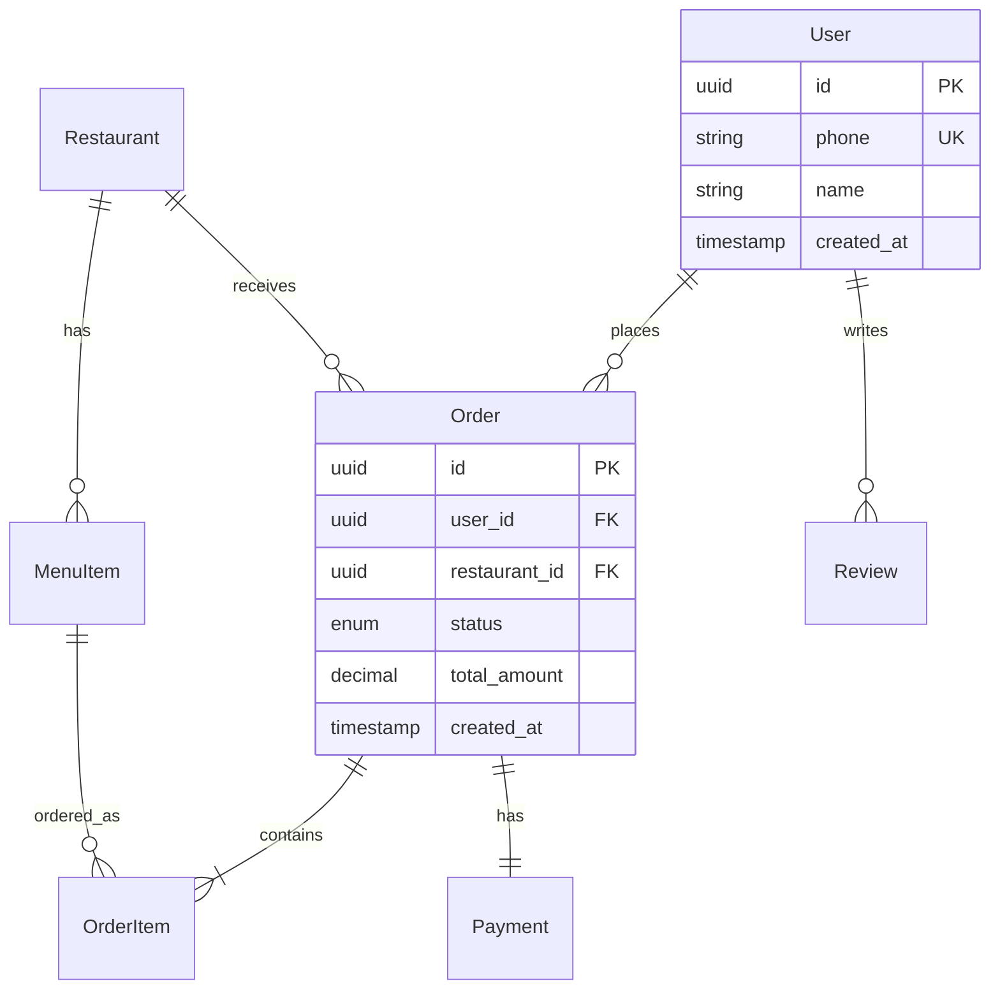

# Data Modeling & ERD

Data model là **xương sống** của hệ thống. Sai data model = sửa lại toàn bộ feature. Skill này giúp BA dịch yêu cầu nghiệp vụ thành Entity-Relationship Diagram (ERD) và Data Dictionary chuẩn.

## Khái niệm cốt lõi

### Entity (Thực thể)
"Thứ" mà hệ thống cần lưu thông tin. Thường là **danh từ** trong yêu cầu nghiệp vụ.

Ví dụ trong app đặt món:
- **User** (Người dùng)
- **Restaurant** (Nhà hàng)
- **MenuItem** (Món ăn)
- **Order** (Đơn hàng)
- **OrderItem** (Chi tiết đơn)
- **Payment** (Thanh toán)
- **Review** (Đánh giá)
- **Address** (Địa chỉ)

### Attribute (Thuộc tính)
Thông tin của entity. Phân loại:

| Loại | Ví dụ | Đặc điểm |
|---|---|---|
| **Identifier (PK)** | user_id | Duy nhất, không null |
| **Descriptive** | name, email, phone | Mô tả entity |
| **Foreign Key (FK)** | restaurant_id trong Order | Trỏ tới entity khác |
| **Derived** | age (từ birthday), total_amount (từ items) | Tính từ dữ liệu khác |
| **Composite** | full_address (street + city + zip) | Gồm nhiều phần |
| **Multivalued** | phone_numbers | Cần bảng phụ |

### Relationship (Quan hệ)

Thường có 3 loại cardinality:

| Loại | Ký hiệu | Ví dụ |
|---|---|---|
| **1-to-1** (1:1) | `─────` | User ↔ Profile (mỗi user có 1 profile) |
| **1-to-Many** (1:N) | `─────<` | Restaurant ↔ MenuItem (1 nhà hàng nhiều món) |
| **Many-to-Many** (M:N) | `>────<` | User ↔ Restaurant (qua Favorite, qua Order) |

**Tham gia (Participation):**
- **Mandatory** (─●): bắt buộc tham gia (Order PHẢI có User)
- **Optional** (─○): không bắt buộc (User CÓ THỂ có Review hoặc không)

## Quy trình thiết kế ERD

### Bước 1: Identify Entity

Đọc kỹ requirement, gạch chân **danh từ** quan trọng. Lọc:
- Bỏ những danh từ chỉ thuộc tính (name, price → không phải entity)
- Gộp synonyms (Customer = User = Buyer → chọn 1 tên)
- Loại danh từ tạm thời (today, screen → không lưu DB)

### Bước 2: Identify Attribute

Với mỗi entity, list attributes. Hỏi:
- Cần lưu gì để **identify** entity? (PK)
- Cần gì để **mô tả** entity? (name, type, ...)
- Cần gì để **liên kết** với entity khác? (FK)
- Cần gì để **audit**? (created_at, updated_at, created_by)

### Bước 3: Identify Relationship

Với mỗi cặp entity, hỏi:
- Có quan hệ không?
- Cardinality? (1:1, 1:N, M:N)
- Bắt buộc hay không?

**Mẹo phát hiện M:N**: nếu 2 entity đều có thể có "nhiều" entity kia → M:N → cần bảng trung gian (junction table).

Ví dụ: User và Restaurant
- 1 User có thể yêu thích nhiều Restaurant
- 1 Restaurant có nhiều User yêu thích
- → Cần bảng **Favorite** (user_id, restaurant_id, created_at)

### Bước 4: Normalization (Chuẩn hoá)

Áp dụng 3 normal forms (3NF) cho hầu hết trường hợp:

#### 1NF (First Normal Form)
- Mọi field là **atomic** (không có list, không nested)
- ❌ `phone: "0901111111, 0902222222"` → ✅ Tách bảng UserPhone

#### 2NF (Second Normal Form)
- Đã 1NF
- Mọi non-key attribute phụ thuộc **toàn bộ** PK (không phải 1 phần)
- Áp dụng khi PK composite

#### 3NF (Third Normal Form)
- Đã 2NF
- Không có **transitive dependency** (A → B → C)
- ❌ Trong bảng Order có `customer_id, customer_name, customer_email` → customer_name/email phụ thuộc customer_id → tách ra bảng Customer

> **Pragmatic note**: Đôi khi denormalize có chủ ý (cho performance, reporting). Đừng cứng nhắc.

### Bước 5: Vẽ ERD

Có 2 notation phổ biến:

#### Crow's Foot (phổ biến nhất)

```
┌──────────────┐         ┌──────────────┐
│   Restaurant │         │   MenuItem   │
├──────────────┤         ├──────────────┤
│ PK id        │1───────<│ PK id        │
│    name      │         │ FK rest_id   │
│    address   │         │    name      │
│    phone     │         │    price     │
└──────────────┘         └──────────────┘
        1                       N
   (1 Restaurant)          (N MenuItem)
```

Ký hiệu:
- `1` hoặc `│` — one
- `N`, `M`, hoặc crow's foot `─<` — many
- `─●` — mandatory
- `─○` — optional

#### Chen Notation (academic, ít dùng thực tế)

Dùng hình thoi cho relationship, hình elip cho attribute.

### Bước 6: Data Dictionary

Bảng chi tiết cho mỗi entity:

```markdown
## Entity: Order

| Field | Type | Constraints | Default | Description |
|---|---|---|---|---|
| id | UUID | PK | gen_random_uuid() | Định danh đơn |
| user_id | UUID | FK User.id, NOT NULL | - | Khách đặt |
| restaurant_id | UUID | FK Restaurant.id, NOT NULL | - | Nhà hàng |
| status | ENUM | NOT NULL | 'pending' | pending/paid/confirmed/preparing/delivered/cancelled |
| total_amount | DECIMAL(12,2) | NOT NULL, ≥ 0 | 0 | Tổng tiền VNĐ |
| shipping_fee | DECIMAL(10,2) | NOT NULL | 0 | Phí ship |
| payment_method | ENUM | NOT NULL | - | cod/vnpay/momo/zalopay |
| delivery_address | TEXT | NOT NULL | - | Địa chỉ giao |
| note | TEXT | NULL | - | Ghi chú khách |
| created_at | TIMESTAMP | NOT NULL | NOW() | Thời gian tạo |
| updated_at | TIMESTAMP | NOT NULL | NOW() | Lần cuối cập nhật |
| paid_at | TIMESTAMP | NULL | - | Thời điểm thanh toán |
| delivered_at | TIMESTAMP | NULL | - | Thời điểm giao xong |

**Indexes**:
- idx_order_user_id (user_id)
- idx_order_status (status)
- idx_order_created_at (created_at DESC)

**Business Rules**:
- BR1: total_amount = SUM(order_items.subtotal) + shipping_fee
- BR2: Khi status chuyển sang 'paid', set paid_at = NOW()
- BR3: Đơn 'pending' quá 15 phút auto-cancel
```

## ERD ví dụ đầy đủ: App "Ăn Gì Hôm Nay"

```
┌─────────────────┐
│      User       │
├─────────────────┤
│ PK id           │
│    phone (uniq) │
│    name         │
│    email        │
│    avatar_url   │
│    created_at   │
└────────┬────────┘
         │1
         │
         │N
┌────────▼────────┐         ┌─────────────────┐
│     Order       │         │  Restaurant     │
├─────────────────┤         ├─────────────────┤
│ PK id           │N       1│ PK id           │
│ FK user_id      ├────────►│    name         │
│ FK restaurant_id│         │    address      │
│    status       │         │    lat, lng     │
│    total_amount │         │    phone        │
│    payment_meth │         │    open_hours   │
│    created_at   │         │    status       │
└────────┬────────┘         └────────┬────────┘
         │1                          │1
         │                           │
         │N                          │N
┌────────▼────────┐         ┌────────▼────────┐
│   OrderItem     │N       1│   MenuItem      │
├─────────────────┤────────►├─────────────────┤
│ PK id           │         │ PK id           │
│ FK order_id     │         │ FK restaurant_id│
│ FK menu_item_id │         │    name         │
│    quantity     │         │    description  │
│    price        │         │    price        │
│    note         │         │    image_url    │
└─────────────────┘         │    is_available │
                            └─────────────────┘

┌─────────────────┐         ┌─────────────────┐
│    Payment      │         │     Review      │
├─────────────────┤         ├─────────────────┤
│ PK id           │         │ PK id           │
│ FK order_id (uq)│         │ FK user_id      │
│    method       │         │ FK restaurant_id│
│    amount       │         │ FK order_id (uq)│
│    status       │         │    rating (1-5) │
│    transaction_id│        │    comment      │
│    paid_at      │         │    created_at   │
└─────────────────┘         └─────────────────┘
```

## Nguyên tắc đặt tên (Naming Conventions)

### Table names
- **snake_case**, danh từ **số ít** hoặc số nhiều (chọn 1 và nhất quán)
- Recommend: số ít → `user`, `order`, `restaurant`
- Junction table: `user_restaurant_favorite` hoặc `favorites`

### Column names
- **snake_case**, lowercase
- PK: `id` (đơn giản) hoặc `user_id` (rõ ràng hơn)
- FK: `<referenced_table>_id` → `user_id`, `restaurant_id`
- Boolean: `is_active`, `has_avatar`, `can_delete` (prefix `is_`, `has_`, `can_`)
- Timestamp: `created_at`, `updated_at`, `deleted_at` (soft delete)
- Money: `_amount`, `_price`, `_fee` (suffix), luôn dùng DECIMAL

### Tránh
- ❌ Viết tắt khó hiểu: `usr_nm` → ✅ `user_name`
- ❌ Reserved keywords: `order`, `user` (một số DB) → prefix nếu cần
- ❌ Mixing language: `ten_user`, `nguoi_dung` → chọn 1 ngôn ngữ, recommend English
- ❌ Plural inconsistency: bảng `users` nhưng `order_item`

## Common Patterns

### 1. Soft Delete
Thêm field `deleted_at` thay vì xoá thật:
```sql
SELECT * FROM users WHERE deleted_at IS NULL;
```

### 2. Audit Fields
Thêm vào mọi bảng:
- `created_at`, `created_by`
- `updated_at`, `updated_by`

### 3. Lookup Tables (Enum vs Table)
- **Enum** (DB enum): cho list ngắn, ít đổi (status: pending/paid/...)
- **Lookup table**: cho list dài hoặc thường đổi (categories, tags)

### 4. Polymorphic Relationship
1 entity liên kết tới nhiều loại entity khác:
- Comment → Post / Product / Article
- → Dùng `commentable_type` + `commentable_id`

### 5. Hierarchical Data (Tree)
- **Adjacency list**: `parent_id` self-reference (đơn giản, query đệ quy)
- **Materialized path**: `path = "/1/3/7/"` (dễ query ancestor)
- **Nested set**: `lft, rgt` (read-heavy, write expensive)
- **Closure table**: bảng phụ lưu mọi cặp ancestor-descendant

### 6. Money & Currency
- Luôn dùng `DECIMAL(precision, scale)`, KHÔNG dùng FLOAT
- Lưu cents/đồng nguyên: `amount: 1000000` thay vì `10000.00`
- Lưu currency: `amount_vnd`, `amount_usd` hoặc field `currency`

## Công cụ vẽ ERD

| Công cụ | Đặc điểm | Cost |
|---|---|---|
| **dbdiagram.io** | Code-as-diagram, sync schema | Free |
| **drawSQL** | Đẹp, collaboration | Free tier |
| **draw.io** | Free, flexible | Free |
| **Lucidchart** | Pro features | Paid |
| **Prisma ERD Generator** | Auto từ schema.prisma | Free |
| **Mermaid** | Markdown-native | Free |

### Mermaid ERD example



## Anti-patterns thường gặp

❌ **"God table"** — 1 bảng 50+ columns, lưu mọi thứ → tách entity
❌ **Storing JSON cho everything** → mất type safety, khó query → dùng JSON cho data không structured thật sự
❌ **Mixing concerns trong 1 bảng** → bảng `user` lưu cả setting, preference, log → tách ra
❌ **EAV (Entity-Attribute-Value)** → linh hoạt nhưng query/index địa ngục → dùng JSONB nếu cần
❌ **Quên index** trên FK và field hay query → query chậm khi data lớn
❌ **Hard-delete sensitive data** → vi phạm audit. Dùng soft delete
❌ **Không có unique constraint** trên field nên duy nhất (email, phone)
❌ **Magic numbers/strings** không có FK → "status = 3 là gì?" → dùng enum hoặc lookup

## Áp dụng cho solo developer

- Solo dev có thể skip ERD formal, nhưng **đừng skip data dictionary**
- Dùng **Prisma schema** hoặc **Drizzle schema** trực tiếp → vừa là code vừa là tài liệu
- Vẽ ERD nhanh bằng dbdiagram.io khi cần share với người khác
- Lưu `docs/data-model.md` trong repo, update theo migration

**Workflow gọn cho solo dev:**
1. List entity (5-10 phút brainstorm)
2. Define attribute cho entity quan trọng (PK, FK, các field chính)
3. Define relationship (1:1, 1:N, M:N)
4. Code Prisma schema (chính là source of truth)
5. Generate ERD từ schema khi cần
